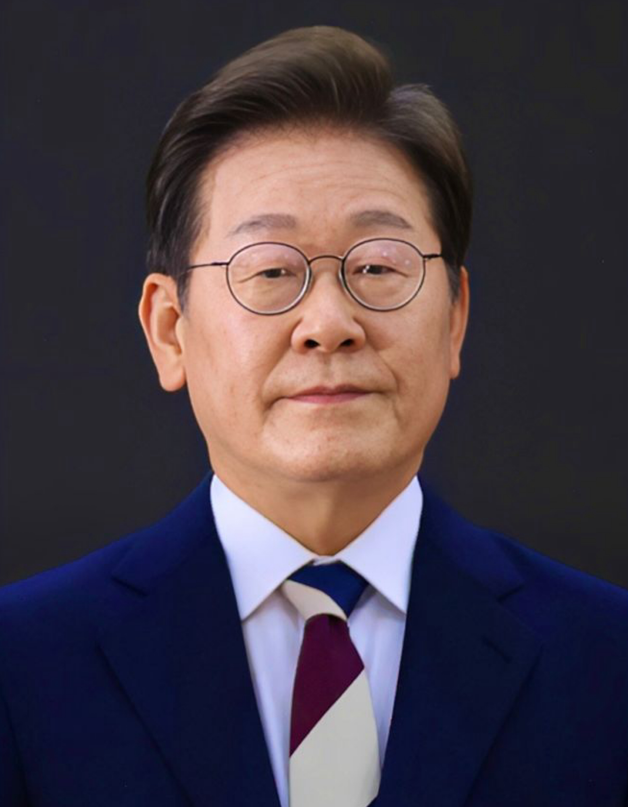
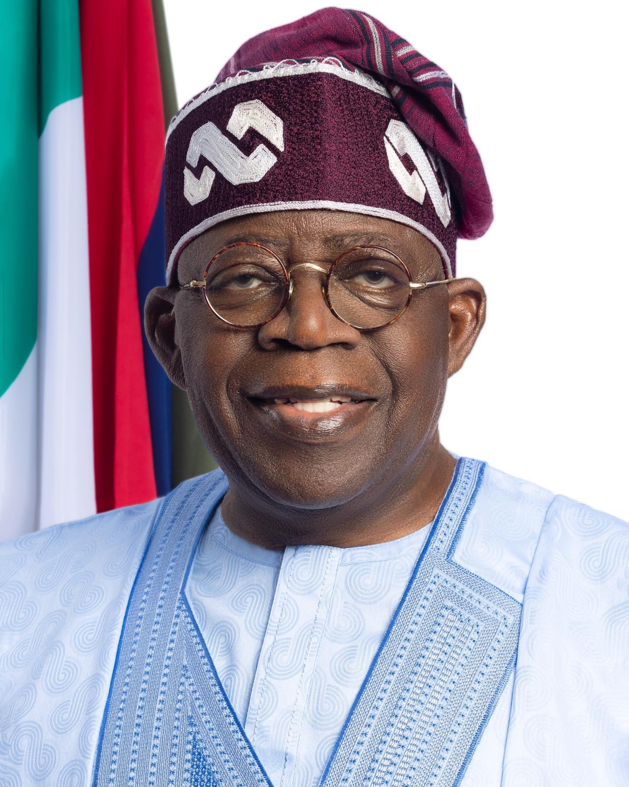

## Attendance {.center}

{height=700}

## Recap + Today

Monday: trade creates **winners and losers**. Stolper-Samuelson, Ricardo-Viner, Rodrik's backlash channels.

Today you apply all of it. You are **economic advisors** to a government navigating the current global trade crisis.

- 3 countries, 9 groups, 3 advisory teams per country
- Your teams research and recommend. Your country elects a Head of State. The Head of State presents at a G3 Summit.

## {.section-slide background-color="#1B2838"}

::: {.section-slide}
# Economic Crisis Cabinet

Trade Policy Under Pressure
:::

## The Three Countries

:::: columns
::: {.column width="32%"}

### Mexico

{height=200}

**President Claudia Sheinbaum**

- GDP growth ~1.3% in 2026
- US tariffs on Mexican goods
- Proposed tariffs on 1,371 product categories to block Chinese imports
- Nearshoring boom from China
- Budget deficit at 36-year high

:::

::: {.column width="32%"}

### South Korea

{height=200}

**President Lee Jae-myung**

- Trade = 85% of GDP
- $350B investment in US industries under tariff pressure
- Semiconductors caught in US-China tech war
- Won under pressure
- Aging population, strained finances

:::

::: {.column width="32%"}

### Nigeria

{height=200}

**President Bola Tinubu**

- GDP growth exceeding 4%
- Fuel subsidy removal caused inflation spike
- Naira devaluation ongoing
- Oil-dependent, trying to diversify
- AfCFTA member
- FDI surging: $720M in Q3 2025

:::
::::

## Three Steps

Each country has **3 advisory teams** (Trade Policy, Domestic Industry, Geopolitical Strategy).

1. **Step 1 (20 min):** Work in your advisory team. Research your country and prepare **3 policy recommendations** for your area.
2. **Step 2 (15 min):** All 3 teams from your country come together. **Elect a Head of State.** Each team briefs the leader. The leader decides on a **unified national strategy.**
3. **Step 3 (15 min):** The 3 Heads of State present their strategy to the class. Other countries ask questions.

## Step 1: Team Research {background-color="#1B2838"}

::: {.section-slide}
# 20 Minutes

Research your country. Prepare 3 policy recommendations for your area.
:::

## Step 1: Guiding Questions

**All teams:**

- What are your country's main exports and imports? Who are its biggest trading partners?
- How is the US tariff escalation affecting your country right now?

**Trade Policy teams:** Should your country raise tariffs, lower them, or negotiate new trade deals? On which goods specifically?

**Domestic Industry teams:** Which industries and workers benefit from the current situation? Which lose? 

**Geopolitical Strategy teams:** Should your country align closer to the US, to China, or try to stay neutral? What are the costs of each?

## Step 2: Country Assembly {background-color="#1B2838"}

::: {.section-slide}
# 15 Minutes

All 3 teams from your country come together. Elect a Head of State.

Each team gives a **2-minute briefing.** The Head of State makes the final call on a unified strategy.
:::

## Step 3: G3 Summit {background-color="#1B2838"}

::: {.section-slide}
# Heads of State Present

3 minutes per country. Cover: your top policy decision, who wins and who loses, and how you position your country internationally.

After each presentation, other countries ask **one question.**
:::

## Debrief

[Which strategy was most politically sustainable? Which was most economically sound? Were those the same?]{.underline}

- Did your advisory teams disagree? How did the Head of State resolve it?
- Did any country's strategy directly conflict with another's?
- Which framework was most useful for your country?

## Questions? {.center}

