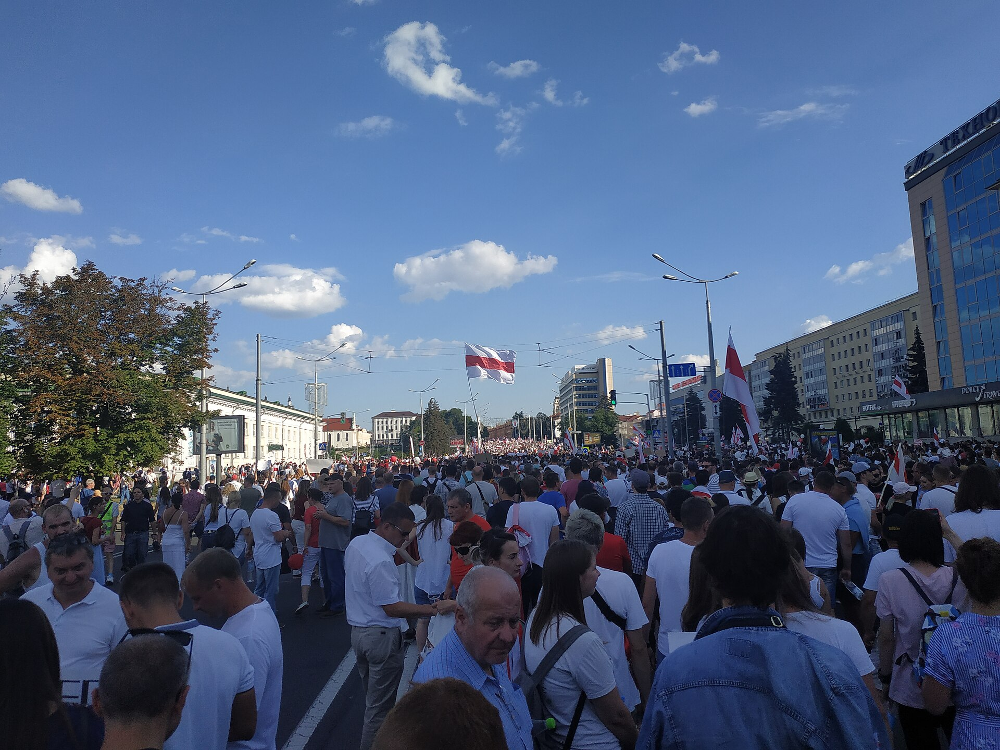

## Attendance {.center}

{height=700}

## Introduction

Last week we talked about what (potentially?) holds the system together. **This week** we ask what happens when that system starts to come apart.

- We begin with a big question: **Was liberal democracy supposed to win?**
- Then we trace how the optimism of the 1990s gave way to a coordinated authoritarian challenge
- And we end with a puzzle: if autocracies are so resilient, why do some of them fall?

::: {.fragment}
Spoiler: one of them migt have fallen **yesterday.**
:::

## Today's Schedule

1. **The End of History?** --- Why liberal democracy seemed like the final answer
2. **What Went Wrong?** --- The third wave of autocratization
3. **Autocracy Inc.** --- How authoritarian regimes cooperate across borders, and where the cracks show

## {.section-slide background-color="#1B2838"}

::: {.section-slide}
# Section 1: The End of History?

Fukuyama, liberal democracy, and why it matters
:::

## 1989

The Berlin Wall falls. The Soviet Union is collapsing. Liberal democracy is spreading across Eastern Europe, Latin America, East Asia.

Francis Fukuyama writes what becomes the most famous (and most misunderstood) claim in modern political science:

::: {.fragment}
The end point of humanity's ideological evolution is **liberal democracy.** Not because conflict stops, but because no competing ideology can claim legitimacy anymore.
:::

::: {.fragment}
[Was he right? For about a decade, it really looked like he was.]{.underline}
:::

## What Is Liberal Democracy?

Two concepts that are related but distinct:

::: {.concept-box}
### Democracy

**Definition:** A political system where leaders are chosen through free, fair, and competitive elections. Key features include universal suffrage, freedom of association, and an elected executive. (Following Robert Dahl's concept of "polyarchy.")
:::

::: {.fragment}
::: {.concept-box}
### Liberalism (Political)

**Definition:** A political ideology grounded in individual rights and personal liberty, including protection from state interference. Emphasizes rule of law, civil liberties, and limits on government power.
:::
:::

::: {.fragment}
**Liberal democracy** combines both: elections *and* rights. You can have elections without liberalism (illiberal democracy) or liberalism without elections (liberal autocracy, historically). The combination is what Fukuyama argued had won.
:::

## Discussion

::: {.discuss}
We have defined liberal democracy. But before we go further: **why should we care?** Why does it matter for international relations whether a country is a liberal democracy or not? What changes in how states interact?
:::

## Why Does Liberal Democracy Matter for IR?

This is not just a domestic politics question. Liberal democracy has specific international consequences:

- **Democratic Peace Theory** (Week 7): Democracies rarely go to war with each other. A world of democracies is, in theory, a more peaceful world
- **Economic growth:** Democracies tend to grow faster than dictatorships over the long run, with more equitable distribution
- **Trust and cooperation:** Democracies can make credible commitments to each other because leaders face domestic accountability
- **Human rights protection:** Liberal democracies are far more likely to protect civil and political rights

::: {.fragment}
If liberal democracy spreads, so does the foundation for a stable international order. That was the bet of the 1990s.
:::

## The Washington Consensus

After the Cold War, a package of ideas dominated international policy:

- Free markets + democratic governance = development
- Open borders, deregulation, privatization
- International institutions (WTO, IMF, World Bank) would lock in liberal norms
- The internet would accelerate the spread of democratic ideas

::: {.fragment}
This was not just optimism -> it was a **policy program** backed by the world's most powerful states and institutions.
:::

::: {.fragment}
[So what happened?]{.underline}
:::

## {.section-slide background-color="#1B2838"}

::: {.section-slide}
# Section 2: What Went Wrong?

From democratic optimism to the third wave of autocratization
:::

## The Data Tell a Story

::: {.quote-block}
"Less than 30 years after Fukuyama and others declared liberal democracy's eternal dominance, a third wave of autocratization is manifest."

*--- Luhrmann & Lindberg, "A Third Wave of Autocratization" (2019), p. 1095*
:::

Key findings from V-Dem data:

- **217 autocratization episodes** across 109 countries from 1900 to 2017
- The third wave (since 1994) mainly affects **democracies**, not just autocracies getting worse
- 70% of recent episodes use **gradual erosion under a legal facade**, not coups
- As of 2024, 72% of the world's population lives under autocracy (V-Dem)

## Three Waves of Autocratization {auto-animate=true}

::: {.timeline}
1. **First wave (1926--1942):** Fascism in Europe. Democracies collapse through military coups and revolutionary takeovers. Italy, Germany, Spain, Japan.
2. **Second wave (1961--1977):** Post-colonial democracies fail. Military coups in Latin America, Africa, Asia. Abrupt and often violent.
3. **Third wave (1994--present):** Gradual erosion from within. Elected leaders slowly hollow out democratic institutions while maintaining a democratic facade.
:::

## The New Playbook

Aspiring autocrats learned from history: coups provoke resistance. The new method is subtler:

- Win elections (sometimes legitimately, sometimes not)
- Stack courts with loyal judges
- Buy or intimidate independent media
- Rewrite electoral rules to lock in advantage
- Harass civil society organizations
- Frame all of this as "defending democracy" or "the will of the people"

::: {.fragment}
By the time anyone sounds the alarm, the institutions are already hollowed out. Scholars call this **"death by a thousand cuts."**
:::

## What Changed?

Several forces converged after 2001:

- **The War on Terror:** The US re-prioritized security over democracy promotion. "Anti-terrorism" became a powerful justification for repression
- **Democratic overconfidence:** Western leaders assumed the internet would spread democracy automatically. It did not
- **Economic backlash:** Neoliberal policies increased inequality in many countries, fueling populist resentment
- **Authoritarian learning:** Dictators got smarter. They studied each other's techniques and shared them

::: {.fragment}
And something else was happening: autocracies were not just surviving. They were **cooperating.**
:::

## Discussion

::: {.discuss}
Fukuyama's "end of history" thesis is often mocked today. But was the core idea wrong, or just premature? What would it take for liberal democracy to become truly universal, and is that even desirable?
:::

## {.section-slide background-color="#1B2838"}

::: {.section-slide}
# Section 3: Autocracy Inc.

How authoritarian regimes cooperate across borders
:::

## The Belarus Puzzle

In 2020, mass protests erupted in **Belarus** after a (supposedly?) stolen election. Up to 1.5 million people in a country of fewer than 10 million took to the streets.

{height=420}

The dictator, Lukashenko, seemed finished.

::: {.fragment}
Then a plane belonging to Russia's FSB flew from Moscow to Minsk. Within weeks, the protest movement was crushed.
:::

::: {.fragment}
[If the people were so clearly against the regime, why did the regime survive?]{.underline}
:::

## From Lone Dictator to Network

Applebaum argues our mental model of dictatorship is outdated:

::: {.quote-block}
"Nowadays, autocracies are run not by one bad guy, but by sophisticated networks composed of kleptocratic financial structures, security services (military, police, paramilitary groups, surveillance), and professional propagandists."

*--- Anne Applebaum, "The Bad Guys Are Winning," The Atlantic (December 2021)*
:::

She calls this network **"Autocracy Inc."**: linked not by ideology but by deals designed to preserve personal power and wealth.

## How Autocracy Inc. Works {auto-animate=true}

**Security cooperation:**

- Russian personnel and tactics transferred to Belarus to suppress protests
- Cuban security advisers and technology deployed in Venezuela
- Wagner Group mercenaries deployed across Africa and the Middle East

## How Autocracy Inc. Works {auto-animate=true}

**Security cooperation:**

- Russian personnel and tactics transferred to Belarus to suppress protests
- Cuban security advisers and technology deployed in Venezuela
- Wagner Group mercenaries deployed across Africa and the Middle East

**Economic lifelines:**

- Russia and China provide loans and oil investment to sanctioned Venezuela
- China maintains major development projects in sanctioned Belarus
- Turkey facilitates illicit Venezuelan gold trade

## How Autocracy Inc. Works {auto-animate=true}

**Security cooperation:**

- Russian personnel and tactics transferred to Belarus
- Cuban security advisers in Venezuela
- Wagner Group across Africa and the Middle East

**Economic lifelines:**

- Russia and China prop up sanctioned Venezuela
- China maintains major projects in sanctioned Belarus
- Turkey facilitates illicit Venezuelan gold trade

**Propaganda synergy:**

- Troll farms promote multiple dictators' messages simultaneously
- Shared narratives: "democracy is weak," "the West is hypocritical"

## The Structural Problem

Applebaum shows us the symptoms. Cooley and Nexon diagnose the **structural disease:**

::: {.concept-box}
### Asymmetric Openness

**Definition:** The liberal order's commitment to openness benefits authoritarian regimes more than liberal democracies. Autocracies access global markets and institutions while insulating their domestic politics from external pressure.

*Source: Cooley & Nexon, "The Real Crisis of Global Order" (2022)*
:::

::: {.fragment}
Democracies cannot easily block authoritarian influence without betraying their own principles. Autocracies can and do block democratic influence at home. The flow of influence is one-directional.
:::

## Sharp Power

Walker and Ludwig add a third layer: **how** authoritarian influence penetrates open societies.

- **Media partnerships:** State-funded outlets partner with local media to shape narratives from within
- **University funding:** Confucius Institutes, research grants with strings attached, academic self-censorship
- **Technology standards:** Authoritarian states push for control over internet protocols, AI regulation, 5G
- **Corporate leverage:** Companies self-censor to maintain market access (Hollywood altering content for Beijing; tech firms complying with authoritarian censorship demands)

::: {.fragment}
The same regimes that ban Twitter at home use it to manipulate elections abroad.
:::

## The Dilemma for Democracies

Cooley and Nexon pose a structural dilemma:

- Responding effectively requires restricting the very openness that defines liberal democracy
- Cracking down on capital flows, limiting tech exports, policing foreign influence all have **illiberal implications**
- Doing nothing allows the exploitation to continue

::: {.fragment}
[Can democracies defend the liberal order without becoming illiberal themselves?]{.underline}
:::

## Discussion

::: {.discuss}
Applebaum describes "Autocracy Inc." as bonded by deals, not ideology. Does this make the network stronger or weaker than an ideologically unified alliance like the Warsaw Pact? What would it take to fracture it?
:::

## But the Story Is Not One-Directional

We have been building a picture of autocratic resilience: networks, structural advantages, sharp power. It sounds bleak.

But in the past 18 months, three regimes that seemed entrenched have all faced dramatic reversals:

- **Syria (December 2024):** Assad's regime collapsed in under two weeks
- **Venezuela (January 2026):** Maduro was captured and removed from power
- **Hungary (yesterday):** Orbán lost a democratic election after 16 years

::: {.fragment}
Each case is different. And the differences matter as much as the outcomes.
:::

## Syria: When the Props Collapse

Assad was the textbook "Maduro model" case: willing to destroy his country to stay in power, propped up by Russia and Iran.

**What changed in late 2024:**

- Russia was bogged down in Ukraine, unable to provide air support or personnel
- Iran and Hezbollah were weakened by Israeli strikes throughout 2024
- Assad's own military had been hollowed out: soldiers did not want to fight for him
- Opposition forces launched a lightning offensive and took Aleppo in three days

::: {.fragment}
On December 8, Assad fled to Moscow. A regime that survived 13 years of civil war collapsed in under two weeks once its external support was gone.
:::

::: {.fragment}
**Lesson (?):** Autocracy Inc. kept Assad alive. When the network was distracted, the regime fell.
:::

## Venezuela: The Regime Outlasts the Leader

Maduro stole the 2024 election from opposition candidate Edmundo Gonzalez, triggering massive protests. Unlike Belarus, international pressure continued to mount.

**January 2026:** US forces captured Maduro. He now faces drug and weapons charges in the US.

::: {.fragment}
But here is the twist: **the regime survived without him.**

- Vice President Delcy Rodriguez assumed power under a Supreme Court ruling
- The military, intelligence services, and Chavista political machine remain intact
- Opposition leader Maria Corina Machado remains in exile
- No democratic transition has occurred yet
:::

::: {.fragment}
**Lesson (?):** Removing the dictator is not the same as removing the dictatorship. The network persists.
:::

## Hungary: Death by Democracy

Orbán did not face a coup or a foreign intervention. He lost an election.

After **16 years** of systematically dismantling democratic institutions, stacking courts, capturing media, and rewriting electoral rules:

- Peter Magyar's Tisza Party built a broad opposition coalition
- Voters turned out in historic numbers
- Results show Tisza winning roughly **138 of 199 seats**: a two-thirds supermajority

::: {.fragment}
Orbán conceded defeat on the night of April 12, 2026.
:::

::: {.fragment}
**Lesson (?):** Even a system designed to be unbeatable can be beaten from within, if the opposition unifies and voters mobilize. Democratic backsliding is not always irreversible.
:::

## Three Cases, Three Mechanisms

[Which of these outcomes is most likely to lead to lasting democratic change? Why?]{.underline}

## If we have time: further discussion

::: {.discuss}
These are three cases where the direction reversed. But autocratization is still advancing in many places around the world. **Can you identify other countries where democratic backsliding is happening right now?** What mechanisms from today's lecture (security cooperation, economic lifelines, sharp power, gradual institutional erosion) do you see at work in those cases?
:::

## Summary

::: {.takeaway}
**Today's key insights:**

- The post-Cold War optimism that liberal democracy had "won" proved premature: a third wave of autocratization has been unfolding since the mid-1990s
- Autocracies cooperate across borders through financial, security, and propaganda networks: what Applebaum calls "Autocracy Inc."
- The liberal order's openness creates *asymmetric vulnerability:* autocracies exploit its benefits while insulating their own politics
- But authoritarian resilience has limits: Assad fell when his backers were distracted, Maduro was removed but his regime persists, and Orbán was defeated at the ballot box
- The question is not whether autocracies can be challenged, but whether what comes after is durable
:::

## Wednesday

Please sit with your team members based on the standard seating map (by group number)! High stakes (deciding presentation order)

## Questions? {.center}

