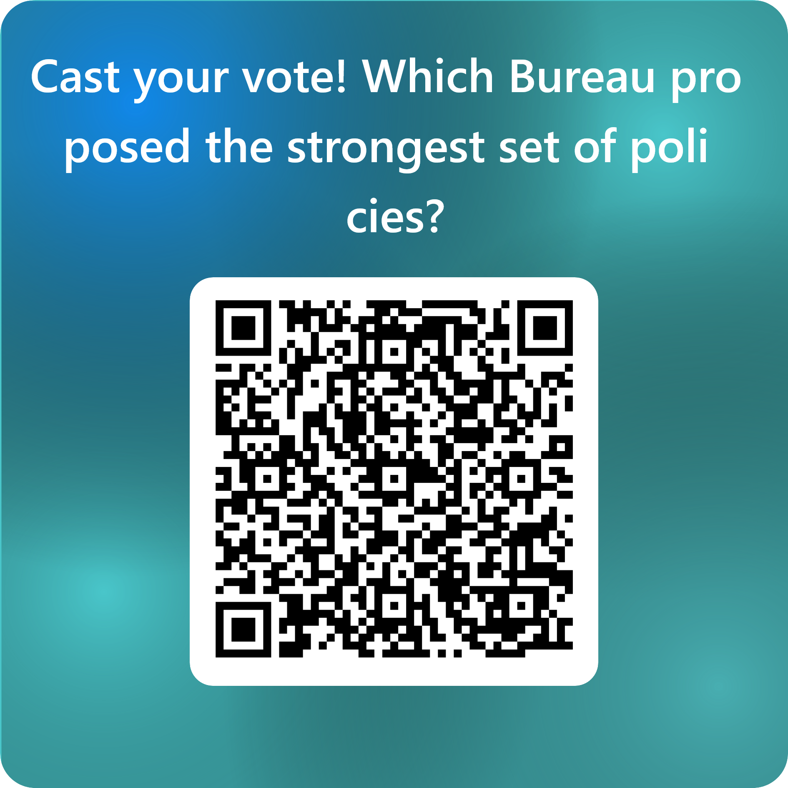

## Attendance {.center}

{height=700}

## Today

Monday we talked about autocratization, democracy, and issues revolving around current trends.

Today, we will offer potential policy solutions to the problem of transnational authoritarianism. We will do this through a **Democratic Defense Summit**.

## The Activity

You are the **Democratic Defense Coordination Office.**

- **4 bureaus**, each tackling one front of the problem
- Each team develops **1 policy proposal** (what it does, who implements it, biggest obstacle)
- Bureaus merge and select their **top 2 proposals** to present
- After all presentations, **you vote** for the bureau with the strongest proposals (you cannot vote for your own). So, your vote goes go to one single bureu/

Bureaus with higher vote counts will be able to decide when to present first!

## The 4 Bureaus

| Bureau | Front | Teams | Rows |
|--------|-------|-------|------|
| **1** | Defend Democracy at Home | 1, 2, 3 | Row 5 (back) |
| **2** | Counter Sharp Power | 4, 5, 6 | Row 4 |
| **3** | Disrupt Autocratic Networks | 7, 8, 9, 10 | Rows 2--3 |
| **4** | Support Democratic Movements Abroad | 11, 12, 13, 14 | Rows 1--2 (front) |

## Bureau 1: Defend Democracy at Home

**Teams 1, 2, 3** --- Row 5 (back)

Potential dimensions to pick from:

- Electoral integrity and institutional safeguards
- Media ecosystem: disinformation and platform regulation
- Economic inequality as fuel for populist backlash

*Hungary showed backsliding can be reversed at the ballot box. What would have prevented it from going so far?*

## Bureau 2: Counter Sharp Power

**Teams 4, 5, 6** --- Row 4

Potential dimensions to pick from:

- Academic and cultural infiltration (Confucius Institutes, foreign funding)
- Tech platforms: manipulation, surveillance exports, AI governance
- Corporate accountability: self-censorship for market access

*The same regimes that ban free expression at home exploit it abroad. How do you close that gap?*

## Bureau 3: Disrupt Autocratic Networks

**Teams 7, 8, 9, 10** --- Rows 2--3

Potential dimensions to pick from:

- Financial sanctions and anti-money laundering
- Energy and supply chain diversification
- Reforming international institutions (UN, WTO, Human Rights Council)
- Arms trade and surveillance technology transfers

*Assad's regime collapsed in under two weeks once Russian and Iranian support was disrupted. Where do you apply pressure?*

## Bureau 4: Support Democratic Movements Abroad

**Teams 11, 12, 13, 14** --- Rows 1--2 (front)

Potential dimensions to pick from:

- Funding civil society and independent media
- Diplomatic solidarity coalitions
- Protecting dissidents and diaspora from transnational repression
- Conditional engagement: tying trade and aid to democratic standards

*Removing Maduro did not remove the dictatorship. How do you design interventions that outlast leaders?*

## {.section-slide background-color="#1B2838"}

::: {.section-slide}
# Step 1: Develop + Merge

35 minutes
:::

## Step 1

**First 25 minutes:** Work within your team. Develop **1 policy proposal.** Be specific:

- **What** does it do?
- **Who** implements it?
- **Biggest obstacle?**

"Increase sanctions" is not a policy. "Freeze the personal assets of officials in regimes scoring below 30 on Freedom House's index" is.

. . .

**Last 10 minutes:** Merge with your bureau. Each team pitches (1 min). Bureau selects the **top 2 proposals** and elects a **spokesperson.**

## {.section-slide background-color="#1B2838"}

::: {.section-slide}
# Step 2: Presentations

3 minutes per bureau
:::

## Step 2

Each spokesperson presents their bureau's **2 best proposals** in 3 minutes.

After each presentation: **one question** from another bureau.

## {.section-slide background-color="#1B2838"}

::: {.section-slide}
# Step 3: Vote + Debrief
:::

## Vote

Scan the QR code to vote on Microsoft Forms.

{height=400}

**Which bureau proposed the strongest policy package?** You cannot vote for your own bureau.

## Debrief

::: {.discuss}
- **Walk me through your thought process.** How did your bureau decide which proposals to keep and which to cut?
- When you voted, what made a proposal convincing? 
- Monday we asked whether democracies can defend the liberal order without becoming illiberal. **Did any proposal you heard today cross that line?**
- How can we connect some of these policies to real world examples of autocratization?
:::

## Questions? {.center}
