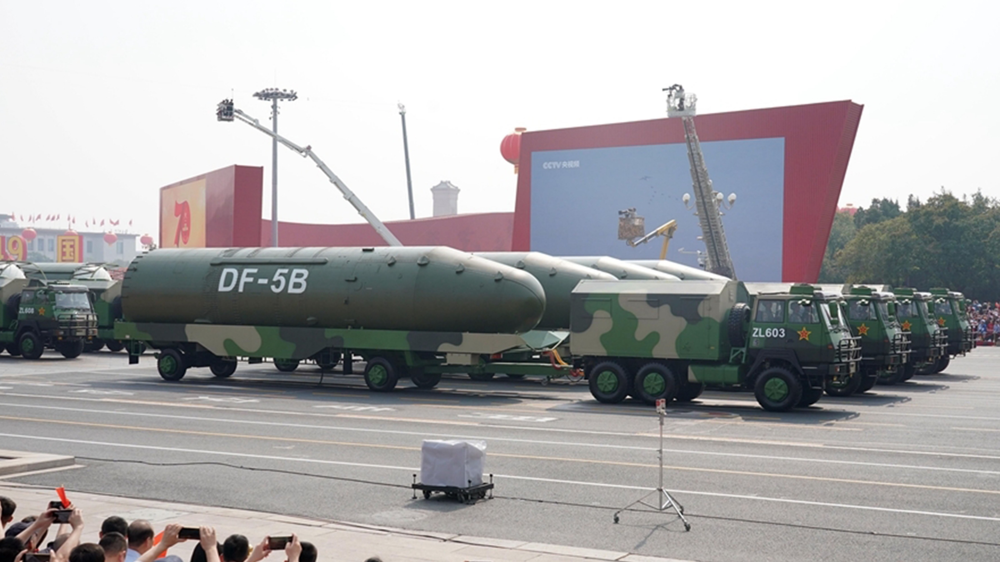
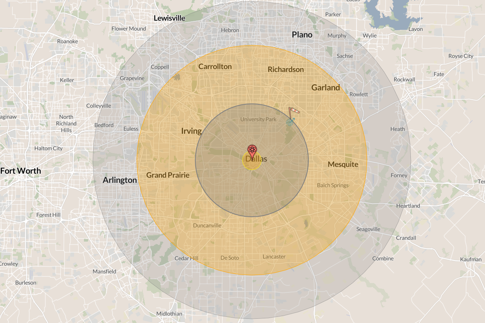

## Attendance {.center}

{height=700}

## Introduction - Housekeeping

- Next week we start with presentations
  
  - 4 dates, 4 slots (2 in the last day)
  
  - Let's finalize groups in order of Bureau win
  
## Pick a slot - 5 minutes to discuss preference among members

- Teams 1 and 2? 

- Team 4

- 5,7,8, 9, 10, 11

- 12 13 14

## Introduction - Presentation

- 12 minutes

- Present what you have (and more) in a clear and engaging way

- Introduce topic/question -> background and context -> actual engagement

- Then, we will have about 5 minutes for open questions

## Introduction

**This week** we confront the biggest question of the course:

[Can humanity cooperate enough to survive threats that could end everything?]{.underline}

*What did you think of the readings? What surprised you?*

## Today's Schedule

1. **What If a Nuclear Bomb Hit Dallas?** --- Making existential risk concrete
2. **The Nuclear Taboo** --- Why norms kept the bomb on the shelf
3. **Existential Risk and the Long View** --- What your generation inherits

## {.section-slide background-color="#1B2838"}

::: {.section-slide}
# What If a Nuclear Bomb Hit Dallas?

Making the abstract concrete
:::

## The Scenario

Imagine: as we sit in this classroom, a single intercontinental ballistic missile launches from central China.

{height=350}

::: {.img-credit}
Chinese DF-5B ICBM on parade in Beijing
:::

- Carries a **4.5-megaton thermonuclear warhead**: roughly 300 times more powerful than the Hiroshima bomb
- Once launched, it reaches Dallas in approximately **30 minutes**

## The Impact

{height=450}

::: {.img-credit}
NUKEMAP simulation: 5 MT surface burst on Dallas, TX
:::

- **535,030 fatalities** and over **1.2 million injuries** within 24 hours
- Fireball: everything at ground zero is vaporized
- Thermal radiation: third-degree burns extend for miles, destroying pain nerves
- Blast wave: residential buildings collapse across the metro area

## And Then It Gets Worse

The immediate destruction is only the beginning:

- **Nuclear retaliation** triggers a global exchange of thousands of warheads
- Soot from burning cities blocks sunlight, dropping temperatures by up to 20°C
- **Nuclear winter** collapses global agriculture
- Billions die from famine over the following years
- Some models suggest **human extinction** is possible

::: {.fragment}
[We are sitting in the blast radius right now. This is not science fiction. Nine countries possess roughly 12,000 warheads.]{.underline}
:::

## {.center}

::: {.discuss}
Before we go further: **what prevents this scenario from happening?**

Think about what you have learned this semester. Is it fear of retaliation? Rational calculation? International norms? Institutions like the UN? Individual leaders making good decisions? Luck?
:::

## {.section-slide background-color="#1B2838"}

::: {.section-slide}
# The Nuclear Taboo

Why haven't nuclear weapons been used since 1945?
:::

## The Puzzle

Since 1945, the United States has fought wars in Korea, Vietnam, and the Persian Gulf against adversaries who **could not retaliate with nuclear weapons**.

- In Korea, U.S. generals explicitly requested to use them
- In Vietnam, the U.S. lost a war while thousands of warheads sat unused
- In the Gulf War, Iraq attacked a nuclear-armed coalition with impunity

::: {.fragment}
[If deterrence explains non-use, why didn't the U.S. use nuclear weapons when there was no fear of retaliation?]{.underline}
:::

## The Conventional Answer: Deterrence

The standard IR explanation is **mutual assured destruction** (MAD):

- States don't use nuclear weapons because the other side will strike back
- Rational actors calculate that first use leads to annihilation
- The balance of terror keeps the peace

Remember from Week 4: this is a **realist** argument. Power balances constrain behavior.

::: {.fragment}
But Tannenwald shows this account is **incomplete at best, wrong at worst**.
:::

## The Intellectual Foundations of Deterrence

Bernard Brodie, writing just one year after Hiroshima, defined the new era:

::: {.quote-block}
"Thus far the chief purpose of our military establishment has been to win wars. From now on its chief purpose must be to avert them."

*--- Bernard Brodie, The Absolute Weapon (1946), p. 76*
:::

Deterrence rests on a specific logic:

- **First-strike capability:** Destroying an adversary's arsenal before they can respond
- **Second-strike capability:** Retaliating even after absorbing a first strike (nuclear submarines, hardened silos, bomber aircraft)
- MAD works only when **both sides** have credible second-strike capability
- The entire system depends on **rational decision-making** under extreme pressure

## The Proliferation Debate: Waltz vs. Sagan

:::: columns
::: {.column width="48%"}
### Waltz: More May Be Better

- Nuclear weapons make states **cautious**: the costs of war become unacceptable
- Even "reckless" leaders are **rational enough** to avoid national suicide
- Proliferation should **stabilize** regions by making aggression suicidal

*Kenneth Waltz, "The Spread of Nuclear Weapons: More May Be Better" (1981)*
:::

::: {.column width="48%"}
### Sagan: More Will Be Worse

- **Organizations**, not rational unitary states, manage nuclear arsenals
- Military organizations have biases: offensive doctrines, secrecy, rigid routines
- **Accidents and miscalculation** are inevitable given enough time and enough states
- The near-misses prove the system is fragile, not stable

*Scott Sagan, "The Perils of Proliferation" (1994)*
:::
::::

::: {.fragment}
[Who is right? The near-misses we will see suggest Sagan has a point. But 80 years of non-use suggest Waltz is not entirely wrong.]{.underline}
:::

## Tannenwald's Argument: Norms Matter

::: {.concept-box}
### The Nuclear Taboo

**Definition:** A normative prohibition against the use of nuclear weapons that has stigmatized them as unacceptable weapons of mass destruction.

- Operates through three effects: **regulative** (constraining use), **constitutive** (defining categories and identities), and **permissive** (shielding conventional weapons from scrutiny)
- Developed over decades through public opinion, international law, arms control regimes, and state practice
- Shaped what counts as a "civilized" state in international society

*Source: Tannenwald, "The Nuclear Taboo," International Organization (1999), pp. 433--434*
:::

## Evidence: The Taboo in Action {auto-animate=true}

**1945 --- No taboo.** Secretary of War Stimson later wrote that the bomb seemed "as legitimate as any other of the deadly explosive weapons of modern war." The burden of proof was on those who *opposed* using it.

## Evidence: The Taboo in Action {auto-animate=true}

**1945 --- No taboo.** Truman's advisers viewed the bomb as just another weapon.

**1950s --- Emerging taboo.** During the Korean War, Eisenhower and Dulles complained that a "tabu" constrained their freedom. Dulles lamented that "in the present state of world opinion we could not use an A-bomb."

- Eisenhower insisted nuclear weapons were "simply another weapon in our arsenal"
- But he could not act on that belief: public opinion had already shifted

*Source: Tannenwald (1999), pp. 449--450*

## Evidence: The Taboo in Action {auto-animate=true}

**1945 --- No taboo.** Truman's advisers viewed the bomb as just another weapon.

**1950s --- Emerging taboo.** Eisenhower tried and failed to treat nuclear weapons as normal.

**1960s --- Entrenched taboo.** In Vietnam, a Johnson administration meeting concluded "use of atomic weapons is unthinkable," with no evident discussion.

- McNamara privately told Kennedy and Johnson: **never initiate nuclear use**
- RAND physicist Samuel Cohen recalled that anyone caught thinking about nuclear options "would find his neck in the wringer in short order"

*Source: Tannenwald (1999), pp. 453--454*

## From the Reading

::: {.quote-block}
"A normative prohibition on nuclear use has developed in the global system, which, although not yet a fully robust norm, has stigmatized nuclear weapons as unacceptable weapons of mass destruction."

*--- Nina Tannenwald, "The Nuclear Taboo," International Organization (1999), p. 433*
:::

::: {.fragment}
This connects directly to **constructivism** (Week 3, Wendt): norms shape interests, define categories, and constitute state identities. Realism alone cannot explain eighty years of non-use.
:::

## Side by Side

:::: columns
::: {.column width="48%"}
### Deterrence Theory

- **Logic:** Fear of retaliation prevents use
- **Key variable:** Material capability (second-strike)
- **Explains:** Superpower non-use after 1960
- **Cannot explain:** Non-use against non-nuclear states
- **Weakness:** Takes interests as given
:::

::: {.column width="48%"}
### Nuclear Taboo

- **Logic:** Normative prohibition stigmatizes use
- **Key variable:** Shared beliefs about legitimacy
- **Explains:** Non-use even without fear of retaliation
- **Cannot explain:** Why the taboo emerged (origins)
- **Weakness:** Could erode under extreme pressure
:::
::::

## Schelling's Alternative: A Tradition, Not a Taboo

Thomas Schelling (Nobel Prize, 2005) offered a third explanation:

- Non-use is not a **taboo** (moral prohibition) but a **focal point**: a bright line that is valuable precisely because it is clear and unambiguous
- "Use" vs. "non-use" is a binary distinction everyone recognizes. Once crossed, there is no obvious next line to hold.
- The tradition is **self-reinforcing**: the longer it holds, the stronger it becomes, because breaking it would destroy a valuable precedent

::: {.fragment}
Tannenwald disagrees: Schelling cannot explain **why** non-use became the focal point in the first place. Her answer: moral and political stigma, not just strategic convenience.

[Is nuclear non-use a moral achievement or a lucky coordination game?]{.underline}
:::

## Near-Misses: When the Taboo Almost Broke

::: {.timeline}
1. **1962** --- Cuban Missile Crisis. Flotilla chief of staff Vasili Arkhipov withholds his consent to a nuclear torpedo launch from submarine B-59, preventing the two other officers from firing
2. **1979** --- A training tape simulating a Soviet attack loads into the U.S. warning system. Bomber crews scramble and missile crews go on alert before the error is caught within minutes
3. **1983** --- Lt. Col. Stanislav Petrov judges a Soviet satellite warning of incoming U.S. missiles to be a false alarm, choosing not to relay it
4. **1983** --- NATO's Able Archer 83 exercise triggers Soviet nuclear preparations
:::

::: {.fragment}
Individual judgment calls, not deterrence theory, saved civilization on each of these occasions.
:::

## Discussion

::: {.discuss}
The nuclear taboo has held for 80 years. Russia's invasion of Ukraine brought nuclear threats back into public discourse. Putin has repeatedly invoked Russia's nuclear arsenal. Can the taboo survive in a world of more nuclear states, new delivery systems, and leaders who openly threaten escalation?
:::

## {.section-slide background-color="#1B2838"}

::: {.section-slide}
# Existential Risk and the Long View

What it means to live at the hinge of history
:::

## What Is Existential Risk?

::: {.concept-box}
### Existential Risk

**Definition:** A risk that could wipe out humanity entirely or permanently reduce its long-term potential.

- **Natural risks** have always existed: asteroid impacts, supervolcanic eruptions, solar storms
- **Anthropogenic risks** are new: humanity only recently gained the capacity to destroy itself
- MacAskill emphasizes that this makes our historical moment unique
- Relevant to IR because these risks require cooperation across borders to solve

*Source: MacAskill, "The Beginning of History," Foreign Affairs (2022)*
:::

## The Long-Termist Framing

MacAskill (2022) flips the standard historical perspective:

- For every person alive today, roughly **ten** have lived and died in the past
- If humanity survives as long as the average mammal species (~1 million years), for every person alive today, **a thousand** will live in the future
- We are, in the most literal sense, the **ancients** of the human story

::: {.fragment}
This reframing changes the moral weight of existential risk. Destroying humanity eliminates every future generation that would have existed, not just the current population.
:::

## Ord's Estimates: How Much Risk?

Toby Ord, *The Precipice* (2020), offers quantitative estimates for existential catastrophe this century:

| Threat | Estimated Probability |
|--------|:--------------------:|
| Asteroid or comet impact | ~1 in 1,000,000 |
| Nuclear war | ~1 in 1,000 |
| Climate change | ~1 in 1,000 |
| Engineered pandemic | ~1 in 30 |
| Unaligned artificial intelligence | ~1 in 10 |
| **Total existential risk this century** | **~1 in 6** |

::: {.fragment}
One in six. Russian roulette. And most of the risk comes from **technologies that did not exist a generation ago**.
:::

::: {.fragment}
What do you think of these numbers?
:::

## Your Generation Inherits This

This is not abstract. Consider what has changed in your lifetime:

- When you were born (~2004--2006), global CO2 was around 377 ppm. Today it exceeds 425 ppm.
- ChatGPT launched in November 2022. Three years later, AI systems write code, generate media, and assist in research at superhuman levels.
- Nine countries possess roughly 12,000 nuclear warheads. Arms control treaties are collapsing.

::: {.fragment}
The decisions made in the next 20--30 years, **your careers, your voting lives, your policy choices**, will determine whether these risks are managed or realized.
:::

## Discussion

::: {.discuss}
MacAskill argues we should weigh the interests of future generations heavily in our decisions today. Critics respond that present suffering demands present action. Should long-term existential risk override short-term priorities like poverty, inequality, and conflict?
:::

## Summary

- **Brodie** redefined military strategy: the purpose of nuclear weapons is to **avert** war, not win it. **Waltz** argues proliferation stabilizes; **Sagan** argues organizations make accidents inevitable.

- **Tannenwald** shows deterrence alone cannot explain 80 years of non-use. A normative prohibition, the nuclear taboo, has stigmatized nuclear weapons. **Schelling** counters that non-use is a self-reinforcing focal point, not a moral achievement.

- **MacAskill and Ord** reframe our historical moment: we live at the beginning of human history, not the end. 

## Next up

- Climate change and other emerging risks

- Mini final activity: existential crisis exercise

## Questions? {.center}

