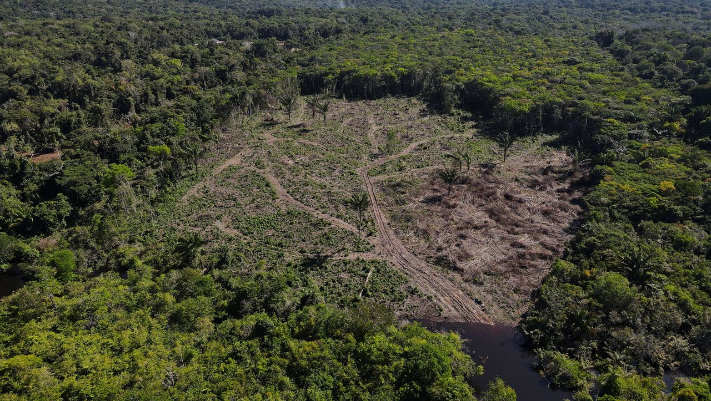

## Attendance {.center}

{height=700}

## Introduction

- Reminder: presentations!

- Then, final exam review session on last lecture before exam

- Final exam, in class, on May 11th

- Final Papers due May 10th

## Today's Schedule

1. **Climate Change and the International Order** --- Planetary threats vs. state-centric institutions
2. **Emerging Risks and the Governance Gap** --- AI, bioweapons, and why governance lags technology
3. **Activity: The Existential Crisis Exercise** --- $100 billion to save the world

## {.section-slide background-color="#1B2838"}

::: {.section-slide}
# Climate Change and the International Order

The mismatch between planetary threats and state-centric institutions
:::

## The Scale of the Problem

Climate change is different from every other IR problem we have studied this semester:

- Caused by the **aggregate actions of everyone** on Earth, not a single actor
- Harms are **delayed**: emissions today cause damage decades from now
- The worst impacts fall on states that **contributed least** to the problem
- Solving it requires cooperation among **every major economy** simultaneously

::: {.fragment}
[Why is this a harder collective action problem than nuclear arms control?]{.underline}
:::

## The Tragedy of the Commons

::: {.concept-box}
### Collective Action and the Global Commons

Garrett Hardin (1968) showed that **shared resources** are depleted when individual users act rationally but independently.

- The atmosphere is the ultimate **commons**: every state benefits from emissions, but the costs are shared globally
- Each state has a **free-rider incentive**: let others cut emissions while continuing to grow
- The larger the group, the harder cooperation becomes (Olson, 1965). Climate requires near-universal participation among 193 states.
- Unlike nuclear arms control (bilateral, verifiable), climate cooperation has **no enforcement mechanism** and no way to exclude free-riders
:::

::: {.fragment}
This is the structural logic of anarchy (Week 3) applied to the planet itself.
:::

## Patrick's Diagnosis: Institutional Failure

::: {.concept-box}
### Planetary Politics

Stewart Patrick argues that the multilateral system treats ecological crises as **secondary** to traditional security and economic concerns.

- The climate regime depends on "a hodgepodge of uncoordinated national pledges driven by short-term domestic political and economic considerations"
- Global spending on conservation: ~$68 billion (roughly the global ice cream market)
- Global spending on environmentally damaging subsidies: **$4--6 trillion per year**
- The institutions built after 1945 were designed for interstate conflict, not planetary survival

*Source: Patrick, "The International Order Isn't Ready for the Climate Crisis," Foreign Affairs (2021)*
:::

## What Patrick Proposes

Patrick calls for three shifts:

1. **Redefine sovereignty:** States do not have unlimited sovereignty over their natural environment. Territorial sovereignty "should not constitute a blank check to plunder collective resources."

2. **Put a price on nature:** Carbon taxes, border carbon adjustments, elimination of fossil fuel subsidies. Make firms assume the ecological costs of their activity.

3. **Strengthen multilateral environmental governance:** A global environmental pact with actual enforcement mechanisms, not aspirational pledges.

::: {.fragment}
Each proposal runs directly into the obstacles we studied in Weeks 2--3 (anarchy), Week 12 (IOs), and Week 13 (illiberalism).
:::

::: {.fragment}
What do you think?
:::

## The Power Dimension

:::: columns
::: {.column width="55%"}
Satia (2022) adds a layer Patrick underplays:

- Climate discourse is shaped by **who gets to define "sacrifice"** and who bears its costs
- The industrialized world built its wealth on carbon emissions. Asking developing countries to "sacrifice" growth assumes all states started equal.
- 3.3 to 3.6 billion people live in areas **highly vulnerable** to climate change, most of whom contributed least to the problem
:::

::: {.column width="40%"}
{height=400}

::: {.img-credit}
Aerial view of deforestation in the Amazon Basin
:::
:::
::::

::: {.fragment}
This connects to Week 6 (race, class, identity) and Week 11 (IPE). Climate politics is inseparable from the global distribution of power.
:::

## Why Wet-Bulb Temperature Matters

A concept your generation may confront directly:

- **Wet-bulb temperature** measures heat combined with humidity at 100% saturation
- At 35°C (95°F) wet-bulb, the human body **cannot cool itself**. Shade, water, rest: none of it matters. Death follows within hours.
- Already at 1.46°C warming above pre-industrial average. On track for 2°C or more unless emissions drop to near zero.
- Runaway effects (melting permafrost, methane release, albedo changes) could push warming far beyond current projections

::: {.fragment}
About **physical habitability** of large parts of the Earth.
:::

## Discussion

::: {.discuss}
Is "planetary politics" compatible with an anarchic international system, or does it require something we have never built?
:::

## {.section-slide background-color="#1B2838"}

::: {.section-slide}
# Emerging Risks and the Governance Gap

Why our institutions cannot keep up with our technology
:::

## AI and the Security Dilemma

The **security dilemma** (Weeks 4 and 7) applies directly to artificial intelligence:

- State A develops military AI to protect itself
- State B perceives this as a threat and develops its own
- Both are less secure than if neither had developed it
- In anarchy, neither can trust the other to show restraint

::: {.fragment}
But AI makes the dilemma worse than nuclear weapons:

- **Harder to verify:** AI capabilities are dual-use, embedded in civilian tech, and difficult to measure from outside
- **Lower barriers to entry:** No enriched uranium required. Computing power and talent are the inputs.
- **Faster development cycles:** The gap between "research breakthrough" and "deployed system" is months, not decades
:::

## The Alignment Problem

Beyond military applications, AI poses a deeper challenge:

- The **alignment problem**: how do you ensure that systems more capable than humans pursue goals compatible with human survival?
- Not just Hollywood robots rebelling. The risk is systems empowered around narrow objectives that lack the judgment to use that power responsibly.
- Current AI systems already write code, generate synthetic media, and conduct scientific research. Capabilities are growing faster than our understanding of how to control them.

::: {.fragment}
[Ord estimates the risk from unaligned AI at 1 in 10 this century. Fair?]{.underline}
:::

## Bioweapons: The Invisible Threat

Engineered pandemics represent the risk Ord rates second-highest (1 in 30):

- **CRISPR** has made gene editing cheap and widely accessible
- In 2012, Dutch scientist Ron Fouchier engineered H5N1 bird flu, which kills roughly **half of confirmed human cases**, to be airborne-transmissible between mammals. The engineered strain traded lethality for transmissibility, but the experiment proved a few mutations could make a deadly virus spreadable.
- COVID-19 had a 1--2% fatality rate. The next engineered pathogen may not trade away its lethality.
- Thousands of labs worldwide now have the technical capacity to create dangerous pathogens

::: {.fragment}
The Biological Weapons Convention (1972) lacks a verification mechanism. Its Implementation Support Unit employs **four staff members** on a budget of $2.1 million, less than the revenue of an average McDonald's restaurant.

*--- Ord, The Precipice (2020)*
:::

## The Regime Gap

Why does governance lag behind technology? Compare the density of international regimes:

| Domain | Key Agreements | Enforcement | Maturity |
|--------|---------------|-------------|----------|
| **Nuclear** | NPT, CTBT, IAEA, New START | Inspections, sanctions | 50+ years |
| **Climate** | UNFCCC, Kyoto, Paris | Voluntary pledges, no penalties | ~30 years |
| **Bioweapons** | BWC (1972) | None. 4 staff. $2.1M budget. | Hollow |
| **AI** | None binding | Nothing | ~0 years |

## Discussion

::: {.discuss}
Can norms restrain AI the way the nuclear taboo restrained the bomb? What would an "AI taboo" even look like, and who would enforce it?
:::

## {.section-slide background-color="#1B2838"}

::: {.section-slide}
# Activity: The Existential Crisis Exercise

An anonymous donor has $100 billion for you
:::

## The Scenario

An anonymous billionaire wants to give your group **$100 billion** to reduce the risk of human extinction before 2100.

But first, they need your assessment.

**You will answer two questions** via a form:

1. **Risk Assessment:** How likely is each threat to wipe out humanity before 2100? (0% to 100%)
2. **Resource Allocation:** How do you distribute $100 billion across the four threat areas?

## Threats

**The four threat categories:**

| Category | Examples |
|----------|---------|
| **Nuclear weapons** | Arms race, accidental launch, taboo erosion |
| **Climate change** | Warming, tipping points, resource wars |
| **Natural causes** | Asteroids, supervolcanoes, solar storms |
| **Future technologies** | AI, engineered pandemics, unknown unknowns |

For each: rate the risk (0--100%) **and** allocate your share of $100 billion.

## Activity Instructions

**Step 1:** Get in group of 2--3 people

**Step 2:** Discuss as a group and fill out the Microsoft Form (10 minutes)

{height=500}

## How Are You Going to Spend $100 Billion to Save the World? {.center}

[Let's see what the class decided.]{.underline}

## Discussion

Let's discuss the risk numbers first:

- **Which threat did most groups rate highest?** Does the class agree with Ord's ranking?
- Ord puts AI at 1 in 10, climate at 1 in 1,000. **Did you agree?** Why or why not?
- **Natural causes** (asteroids, supervolcanoes) are the oldest risks. Did any group rate them high? Why do they tend to get less attention?

::: {.fragment}
[Did any group rate a threat above 50%? What does it feel like to say there's a coin-flip chance of extinction?]{.underline}
:::

## Discussion (cont.)

Now the money:

- **Did your spending match your risk assessment?** If you rated AI highest but spent more on climate, why?
- Some threats can be reduced through **diplomacy** (nuclear arms control). Others require **research** (AI alignment) or **regulation** (bioweapons). Did the type of solution affect your allocation?
- **Is $100 billion enough?** The world spends $2.4 trillion on military budgets annually. What does that tell us about how we currently prioritize these risks?

::: {.fragment}
[Who *should* decide how to allocate resources against existential risk? Governments? International organizations? Private donors? Scientists?]{.underline}
:::

## Final Discussion

::: {.discuss}
1. We spent the semester studying how states cooperate (or fail to cooperate) under anarchy. Based on what you have learned, **are you optimistic or pessimistic** about humanity's ability to manage these threats?

2. Can IR do anything about it?
:::

## Up next

- Presentations!

- Review and Final!

## Questions? {.center}
